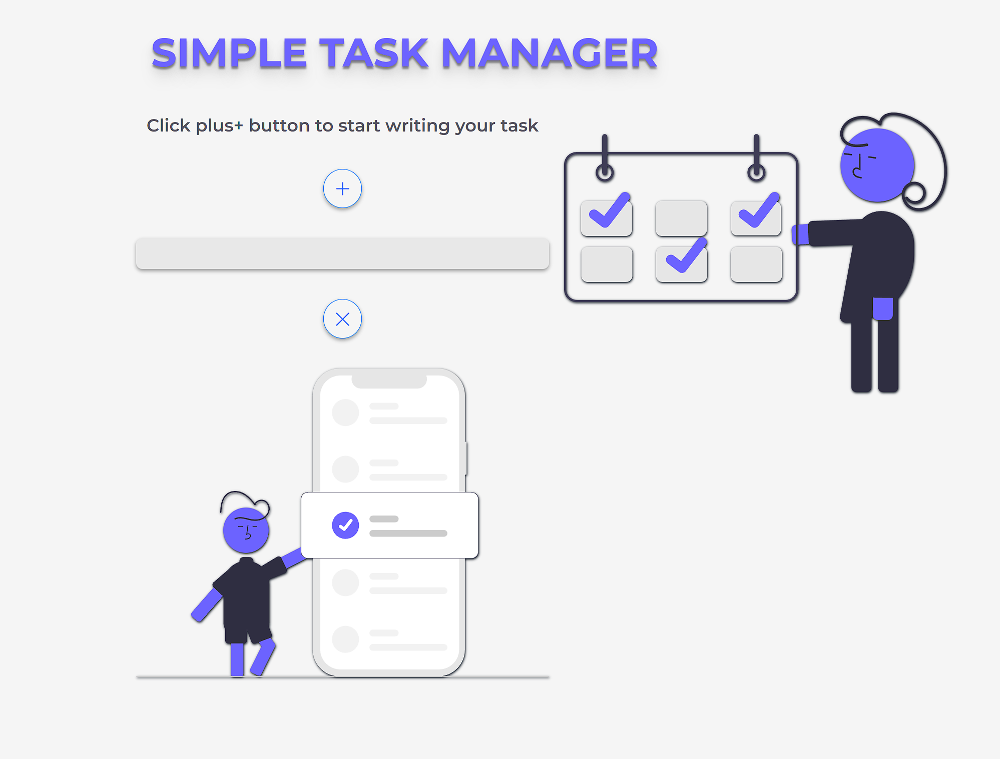

# Simple Task Manager App

The Simple Task Manager App is a web-based task management application built with React. It allows users to create, edit, and delete tasks, providing a simple and intuitive interface for organizing their daily activities.

{:width="200px"}

## Features

- Add new tasks: Users can easily add new tasks by clicking on the **+** button and entering the task details in the input field. Pressing **Enter** will add the task to the list.
- Edit existing tasks: Users can edit tasks by clicking on the pencil icon next to the task. This opens a modal where they can modify the task details and save the changes.
- Delete tasks: Users can remove tasks from the list by clicking on the cross icon next to the task. A confirmation dialog is displayed to ensure the user's intent.
- Mark tasks as completed: Users can mark tasks as completed by clicking on the task itself. Completed tasks are visually distinguished with a strikethrough effect.
- Local storage: The app utilizes local storage to persist the task list, ensuring that tasks are retained even when the user closes the browser or refreshes the page.

## Installation

To run the Simple Task Manager App locally, follow these steps:

1. Clone the repository:
git clone https://github.com/your-username/simple-task-manager.git

2. Navigate to the project directory:
cd simple-task-manager

3. Install the dependencies:
npm install

## Usage

1. Start the app:

2. Open your web browser and visit [http://localhost:3000](http://localhost:3000).

## How to Use

1. Upon launching the app, you will see a user-friendly interface with a task list.
2. To add a new task, click on the **+** button. A modal will appear, allowing you to enter the task details. Press **Enter** or click the "Add task / Save changes" button to add the task to the list.
3. Existing tasks are displayed as a list, with each task showing the task name.
4. To edit a task, click on the pencil icon next to the task. This will open a modal with the task details pre-filled. Make any necessary changes and click the "Add task / Save changes" button to save the updated task.
5. To delete a task, click on the cross icon next to the task. A confirmation dialog will appear to confirm the deletion. Clicking "OK" will remove the task from the list.
6. To mark a task as completed, click on the task itself. The task will be visually marked as completed with a strikethrough effect.
7. To clear all tasks and start with a fresh list, click on the "X" button at the bottom of the app. A confirmation dialog will appear to confirm the action.

## Contributing

Contributions to the Simple Task Manager App are welcome! If you find any issues or have suggestions for improvements, please open an issue or submit a pull request on the GitHub repository.

## License

This project is licensed under the free LICENSE.

---

Thank you for using the Simple Task Manager App! We hope it helps you stay organized and manage your tasks efficiently. If you have any questions or need further assistance, please don't hesitate to contact us.

